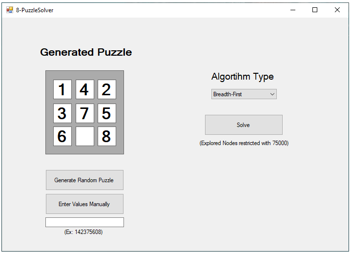

# 8-PuzzleSolver

### This is 8-Puzzle Solver AI application developed in Visual Studio 2019 as Windows Form App.

 <b>You can find release build in /bin/Release folder.</b> 

 <b> There are 4 AI algorithms for solving puzzles.</b> 

* Breadth-First Algorithm
* Depth-First Algorithm
* Depth Limited Algorithm
* Iterative Deepening Search Algorithm

